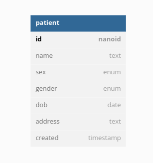

# Health Samurai assignment

This repo contains the solution to the Health Samurai [assignment](./resources/assets/hs-assignment.pdf).

## Installation

This project uses the [Clojure CLI](https://clojure.org/guides/deps_and_cli) as the package manager as well as [docker](https://www.docker.com/) to run a local database. [Shadow CLJS](https://shadow-cljs.github.io/docs/UsersGuide.html) and [npm](https://nodejs.org/en) is used as the build tools for the frontend, the clojurescript dependencies are still contained in the deps.edn file.

## Stack

- backend
  - database
    - [postgres](https://www.postgresql.org/) - SQL database
    - [next.jdbc](https://github.com/seancorfield/next-jdbc) - clojure database access
    - [honey sql](https://github.com/seancorfield/honeysql) - write database queries as clojure maps
    - [hikari-cp](https://github.com/tomekw/hikari-cp) - jdbc connection pool
    - [migratus](https://github.com/yogthos/migratus) - database migration library
  - routing
    - [reitit](https://github.com/metosin/reitit) - data driven routing library
    - [swagger](https://swagger.io/) - api documentation
    - [malli](https://github.com/metosin/malli) - schema definitions and coercion
  - utility
    - [integrant](https://github.com/weavejester/integrant) - clojure state management
    - [nanoid](https://github.com/ai/nanoid) - URL-friendly unique string ID generator
- frontend
  - [reagent](https://reagent-project.github.io/) - clojurescript react wrapper
  - [re-frame](http://day8.github.io/re-frame/) - clojurescript state management
  - [material ui](https://mui.com/) - react ui component library
  - [re-frame-10x](https://github.com/day8/re-frame-10x) - re-frame debugging dashboard
- testing
  - [cognitect test runner](https://github.com/cognitect-labs/test-runner) - clojure unit testing for backend
  - [cypress](https://www.cypress.io/) - e2e testing for frontend

## Data Model



## Routes

- `/` - frontend client
  - `/` - patient table
  - `/new-patient` - create new patient route
  - `/patient/:id` - patient information
- `/api/` - backend api
  - `/health-check` - check to see if server is alive
  - `/patient` - patient CRUD

## Usage

First download and run the postgres instance using `docker compose` inside of the working directory.

```bash
$ docker compose up -d
$ docker ps -a
CONTAINER ID   IMAGE                        COMMAND                  CREATED        STATUS                      PORTS                                       NAMES
3e0fb42d3001   postgres                     "docker-entrypoint.s…"   20 hours ago   Up 33 minutes
```

Now you can run the main function using the `:server` alias and access the http server on port 8080.

```bash
$ clj -M:server
```

To run the interactive terminal use the `:dev` alias and evaluate the `start-interactive` function.

```bash
$ clj -M:dev
Clojure 1.11.1
user=> (start-interactive)
```

To run shadow-cljs use the `npm start` command or `npx shadow-cljs watch app`

To run all backend unit test use the `:test` alias.

```bash
$ clj -M:test
```

To run all e2e tests use the `npm run e2e` command or launch the UI with `npm run e2e:ui`

For migrations, we are using a custom subset of [migratus](https://github.com/yogthos/migratus#quickstart-with-native-clojure-projects) through the CLI and migrations are run on startup to keep databases synchronized.
